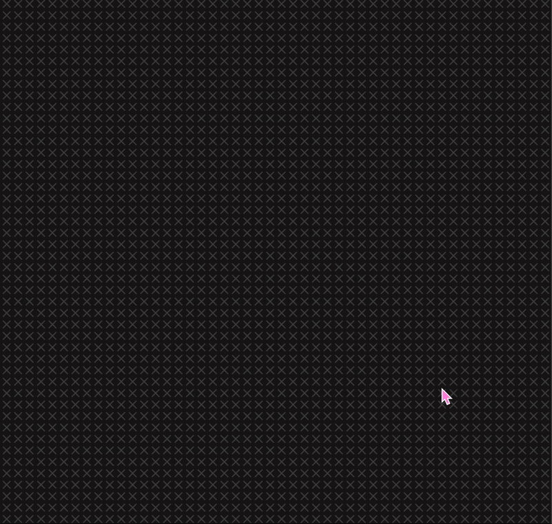

# Moving Cursor

For this project I followed step by step Patt Vira's [tutorial](https://www.youtube.com/watch?v=o5t7PxRJSXk&t=526s) on youtube.

I wanted to immerse myself in coding again and try not to use any coding assistants or ChatBots to really understand every line I was writing.

This method helps me understand better the code and also enables me to actually manipulate the code.

## Choosing the tuto

I chose this particular tutorial as it had interactivity with the mouse and direct visual feedback. I also really liked the fading effect it gave. I was really curious to see how she would make this specific exercise.

## Creating

As it turns out the code was not too complicated and it was easily modifiable to personnalise it more to your taste.

I did not play too much with it. I should try and change the logic a bit to create new colors or shapes in the future if I want to play with it again.

Used it again on the 3rd day of this workshop to incorporate movement.

