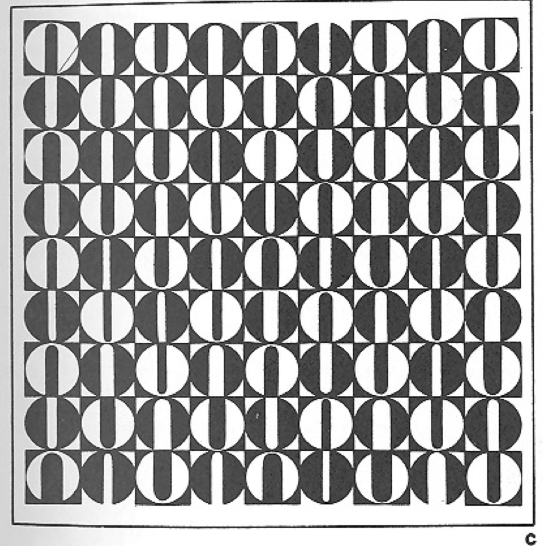
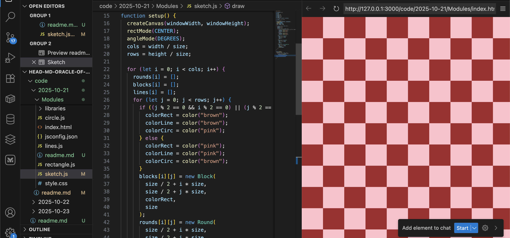
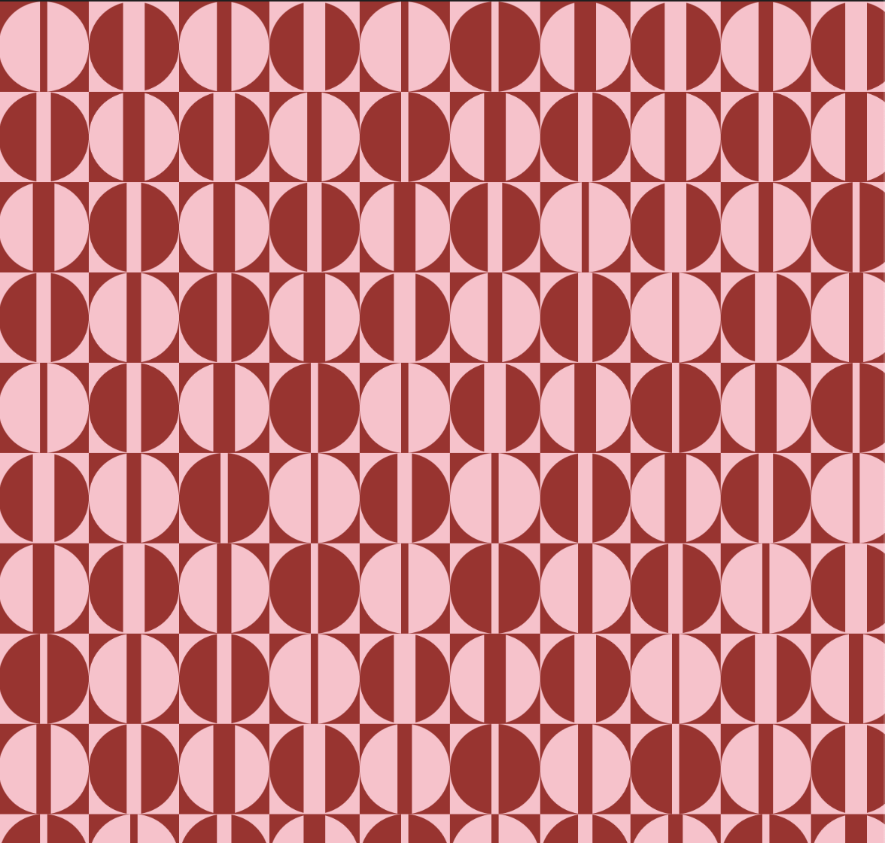
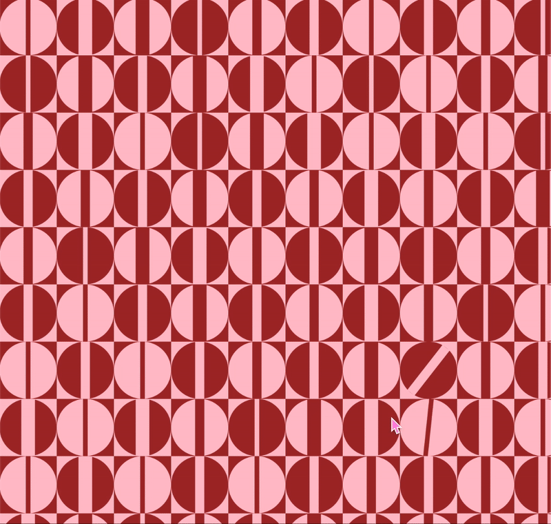

# Checkered Shapes

For this project the goal was to re-create an image from one of the books presented to class during this workshop (or if not inspired by these, from the internet).

I chose the image below from the online version book [Principles of Two-Dimensional Design by Wucius Wong (1972)](https://www.are.na/block/3940539).



I liked the way it looked, and seemed feasable to recreate it while still being a bit challenging.

## Process

I reused a bit of the code from the [cursor project](../CC1/readme.md) again as it had rectangles across the whole screen to start of.



I created classes for each shape:

- circle
- line
- rectangle

And created + displayed them with a for loop.

The part that demanded the most thinking was the coloring of the rectangles part (lol). Had to go back to mathematical thinking and use modulo yay.

```
if ((j % 2 == 0 && i % 2 == 0) || (j % 2 == 1 && i % 2 == 1)) {
        colorRect = color("brown");
        colorLine = color("brown");
        colorCirc = color("pink");
      } else {
        colorRect = color("pink");
        colorLine = color("pink");
        colorCirc = color("brown");
      }
```

I then used the same colors for rectangles and lines and a different one for the circles to display contrast.



In the end I didn't really recreate the image as I didn't give myself the time to figure out the illusions of the lines but I did add some interactivity. When the mouse is at a certain distance from the "lines" they turn. The mechanics are, again, the same we can find in the [cursor project](../CC1/readme.md).


