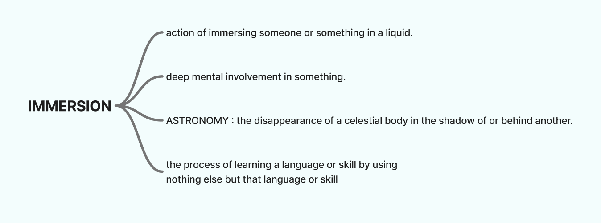

# Ariadne MELISSARGOS

## Research

I’m researching how families, especially children, engage with playful **phygital** installations to learn the origins and cultural histories of playing cards, within the **Oracle of Suits** project.

- **Kids push the limits of objects** (stack higher, bend, try “what happens if…?”).  
  

- **Young people seek hands‑on, tangible control**; physical choices boost attention and recall. (Children’s Learning Experiences in Immersive Museum
  Art Education: An Observational Case Study)

- **Immersion** = a sustained, focused state supported by agency, feedback, and narrative.  
  

- **Combinatorial storytelling**: stacking _country × era × court rank_ yields recognizable (or new) court characters.  
  

- **Agency drives replay**: letting visitors “make” the character encourages iteration and deeper memory (as it's something they have to think about when making the choices). "I felt like a real archeologist", coming from a child that was able to manipulate ancient object on a screen.

- [FigJam board (research notes)](https://www.figma.com/board/6o4bn7YUNu32rzCrzPfZpX/md1-oracle-of-suits?node-id=0-1&t=l24Gbbmwm3jRHzR5-1)

## Stack of Courts

A playful, phygital storytelling experience: visitors stack three “cards” :

- **country**,
- **era**,
- and **court rank**

to conjure a talking character on screen. The character introduces its historical context and reacts to unusual combinations, maybe hinting at fictional “new cards.” Choice creates ownership, repeat play, and sticky learning about the origins of playing cards.

## Keyword

COMBINATIONS

## User Journey

**Scenario:** A family approaches; a child leads the interaction to “make a card.”  
**Beats:** Arrive → explore blocks → pick a country → pick an era → pick a court rank → stack three pieces → character appears + speaks contextual story → try wild combos → replay.

## Novel Combinations

- History
- Combinations
- Character
