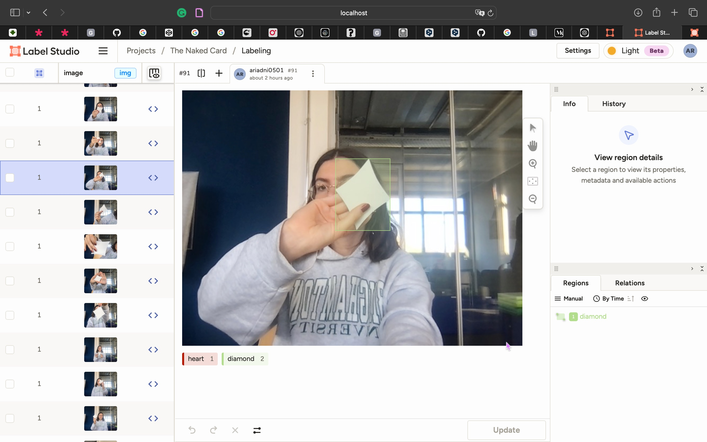
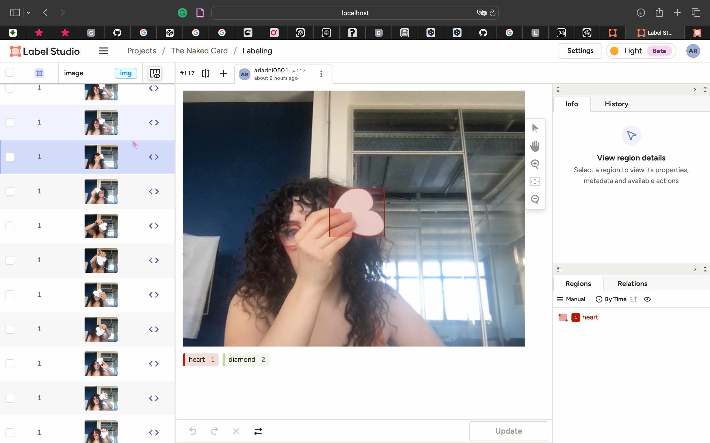
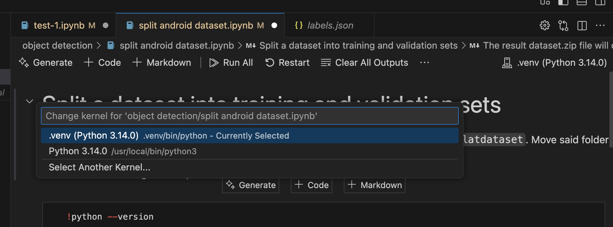

# Tuesday 4th November

## Model Training

To be able to detect different shapes we need to train a model to detect our specific shapes.
Tools and software used :

- MediaPipe
- Google Colab
- LabelStudio
- ChatGPT

### Pictures

I decided to use only 2 shapes to begin with to train our model.

We took in total 183 images :

- 98 of diamonds
- 85 of hearts

We tried to put the shapes in different directions and have different backgrounds. Will do better for the real model if needed. This is to actually test if it could work.

I vibe coded a small programm with p5.js to take pictures and download them directly to my computer with specific names :

name = input (specified by user) + \_ + timestamp

### Binding boxes

Used Label Studio to insert binding boxes to every image to specify where our shapes were and which shape the image had.

The dataset was then exported.

### Datatset

The dataset needed some tweaks (add a category for background for the training at index 0 -> so shift the indexes) and the pictures needed to be separated into 2 folders for training and evaluating.

Pierre Rossel made a python script to do that.

Steps :

- clone repo [MediaPipeTraining](https://github.com/prossel/MediaPipeTraining) from pierre's github.
- insert **dataset** folder in object **detection folder**
- create a new py env
- follow the script and execute

qques petits bugs.
attention au nouvel environnemnt, if it does not work try to disable and activate again.

### Google Colab

The zip should be then used in Google Colab.
Insert in colab and use the link form pierre's repo : good link. Was tweaked from the original.

Then excute all the scripts. And keep the exports which are the models.

Google Colab gives u a temporary web server to use.

ATTENTION : ça prend du temps.

